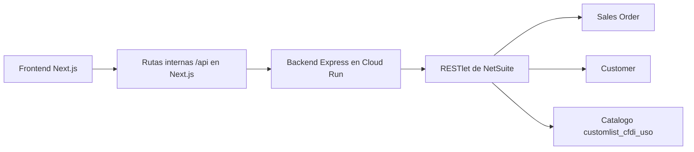
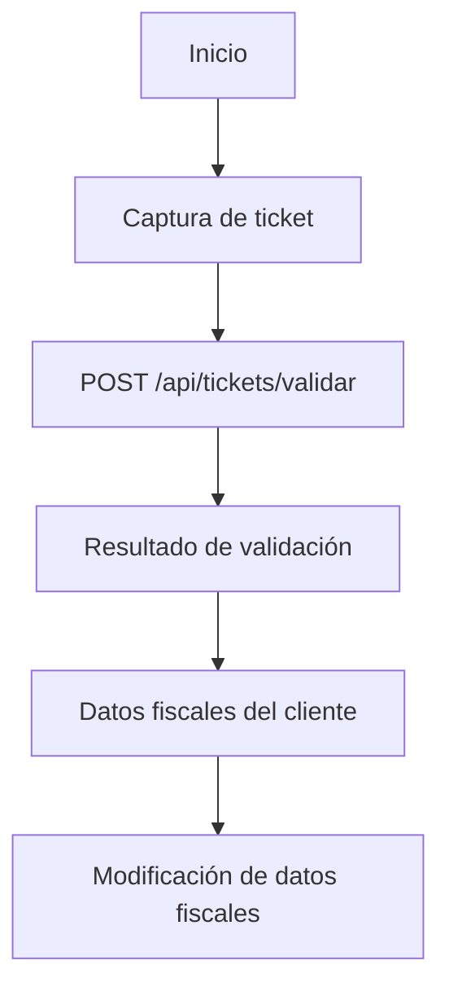

# Avance del proyecto: Portal de Facturación en Línea

## Propósito del documento

Este archivo resume de forma ejecutiva y técnica el avance acumulado del proyecto `Portal_Facturacion_Online`.

Su objetivo es servir como guía rápida para entender:

- qué se ha construido;
- cómo ha evolucionado el flujo funcional;
- qué contratos y endpoints existen hoy; y
- cuál es el estado actual por fecha y por bloque de trabajo.

> Regla de mantenimiento
>
> A partir de este punto, cualquier actualización hecha en `avance` debe reflejarse también en `avance.md`.

---

## Resumen ejecutivo

El proyecto evolucionó desde un portal visual básico en Next.js con tres pantallas hasta un flujo funcional que hoy ya permite:

- validar tickets reales contra NetSuite;
- mostrar el resultado normalizado en frontend;
- evaluar elegibilidad visual del ticket;
- transportar metadatos funcionales clave entre pantallas;
- consultar datos fiscales reales del cliente por `customerId`; y
- abrir una pantalla de modificación fiscal condicionada por RFC.

Actualmente el portal cuenta con estos pasos visibles:

1. Inicio
2. Validación de ticket
3. Resultado de validación
4. Datos fiscales del cliente
5. Modificación de datos fiscales

---

## Vista general de arquitectura



### Patrón oficial del proyecto

- Frontend `Next.js App Router`
- Rutas internas de proxy en `app/api/...`
- Backend `Express` desplegado en `Cloud Run`
- Integración con `NetSuite RESTlet`
- UI publicada en `Firebase App Hosting`

---

## Estructura funcional actual

### Rutas frontend principales

- `/`
- `/iniciar-facturacion`
- `/resultado-validacion`
- `/datos-fiscales`
- `/datos-fiscales-modificacion`

### Endpoints backend principales

```text
POST /api/tickets/validar
POST /api/clientes/datos-fiscales
GET  /api/catalogos/usos-cfdi
```

### Flujo funcional actual



---

## Contrato actual del portal

La respuesta principal consumida por el portal desde `POST /api/tickets/validar` tiene hoy esta forma:

```json
{
  "success": true,
  "status": "encontrado",
  "message": "Ticket localizado correctamente.",
  "data": {
    "ticket": "VALOR_CAPTURADO",
    "salesOrderId": "7799209",
    "salesOrderTranId": "OV674332-A",
    "customerId": "ID_INTERNO_DEL_CLIENTE",
    "total": "50.84",
    "currency": "MXN",
    "dateCreated": "21/05/2026 8:45 AM",
    "ovFacturableEnPortal": true,
    "ticketFacturado": false,
    "matches": 0,
    "ticketField": "custbody_ticket_venta"
  }
}
```

### Reglas vigentes del contrato

- `success` es `true` solo cuando `status === "encontrado"`.
- `status` puede ser:
  - `encontrado`
  - `no_encontrado`
  - `duplicado`
  - `no_elegible`
  - `error_validacion`
  - `error_interno`
- `message` comunica el estado funcional principal.
- `customerId` es un campo plano dentro de `data`.
- La fuente de `customerId` es `entity` en `Sales Order`.
- `matches` aplica al caso `duplicado`.
- `ticketField` identifica el campo oficial de búsqueda en NetSuite.

### Contrato actual de datos fiscales del cliente

```json
{
  "success": true,
  "status": "encontrado",
  "message": "Información fiscal localizada correctamente.",
  "data": {
    "customerId": "3203",
    "razonSocial": "GUILLERMO RAMIREZ VILLANUEVA",
    "rfc": "RAVG730428KU5",
    "usoCfdiId": "ID_INTERNO_USO_CFDI",
    "usoCfdi": "G01-Adquisición de mercancías",
    "regimenFiscal": "605-Sueldos y Salarios e Ingresos Asimilados a Salarios",
    "codigoPostal": "66612"
  }
}
```

### Contrato del catálogo de Uso de CFDI

```json
{
  "success": true,
  "status": "encontrado",
  "message": "Catálogo de Uso de CFDI localizado correctamente.",
  "data": {
    "options": [
      {
        "id": "1",
        "text": "G01-Adquisición de mercancías"
      }
    ]
  }
}
```

---

## Línea de tiempo de avance

## Base del proyecto y estado inicial

### Frontend inicial

- Se creó el proyecto base en `Next.js` con `App Router`.
- Se construyó la landing `/` con logo, título y botón de inicio.
- Se construyó `/iniciar-facturacion` con captura del número de folio o ticket.
- Se construyó `/resultado-validacion` con estados visuales base.
- Se habilitó la navegación entre pantallas principales del flujo.

### Backend inicial

- Se creó un backend base en `/backend` con estructura por capas:
  - configuración
  - rutas
  - controladores
  - servicios
  - manejo de errores
- Se implementó `POST /api/tickets/validar`.
- Se activó validación básica de ticket con longitud configurable.
- Se añadió respuesta mock para:
  - encontrado
  - no encontrado
  - error controlado

### Publicación y validación inicial

- El repositorio fue preparado con Git y publicado en GitHub.
- El frontend fue publicado en Firebase App Hosting.
- Se validó el frontend en `http://localhost:3000`.
- Se validó el backend en `http://localhost:8080`.
- Se validó manualmente el endpoint `POST /api/tickets/validar`.
- Se confirmó un caso mock de ticket encontrado.

### NetSuite inicial

- Se implementó y desplegó un RESTlet base en `/netsuite`.
- Se documentó una matriz mínima de validación para:
  - encontrado
  - no_encontrado
  - duplicado
  - error_validacion
  - error_interno

---

## 13 MAR 2026

### Integración backend con NetSuite

- Se corrigió el build del frontend excluyendo `/backend` y `/netsuite` del `tsconfig` del frontend.
- Se oficializó `ticket` como campo de entrada del backend.
- Se mantuvo compatibilidad temporal con `numeroTicket`.
- El RESTlet quedó alineado para priorizar `ticket` y aceptar `numeroTicket` solo por compatibilidad.
- Se actualizó la documentación del RESTlet para reflejar ese contrato.
- Se ejecutó una prueba real del backend local contra NetSuite.
- Resultado confirmado:

```json
{
  "status": "encontrado",
  "salesOrderId": "7472575",
  "salesOrderTranId": "OV642762-A"
}
```

### Normalización del contrato hacia frontend

- Se aplicó la etapa 4.4 del backend.
- El backend quedó respondiendo con:

```json
{
  "success": true,
  "status": "encontrado",
  "message": "...",
  "data": {}
}
```

- La UI comenzó a consumir la ruta interna `/api/tickets/validar`.
- `/resultado-validacion` quedó conectada a la respuesta real.
- Se validaron localmente casos de:
  - encontrado
  - no_encontrado
  - error_validacion
  - error_interno

### Pulido UI de la fase 5.3

- Se mejoró la jerarquía visual de estados.
- Se dejaron mensajes específicos por estado.
- La pantalla de resultado dejó de depender del mensaje crudo del backend.
- La pantalla de captura mejoró las guías visuales al usuario.

### Preparación de fase 5.4

- Se centralizó `BACKEND_API_BASE_URL`.
- Se creó una utilidad compartida para reenvío de peticiones desde Next.js.
- Se definió un catálogo central de rutas backend en frontend.
- Se documentó `.env.example` del frontend.
- Se definió formalmente el patrón:

```text
frontend -> rutas internas Next.js -> backend desplegado
```

### Cloud Run fase 5.4

- Se verificó soporte de `PORT` dinámico.
- Se agregó `Dockerfile` y `.dockerignore`.
- Se instaló `gcloud`.
- Se autenticó el proyecto `facturacion-en-linea-b2577`.
- Se habilitaron APIs necesarias de Google Cloud.
- Se desplegó exitosamente el backend en Cloud Run.
- Servicio desplegado:

```text
cloud-run-portal-facturacion-en-linea
```

- URL pública:

```text
https://cloud-run-portal-facturacion-en-linea-188969880965.us-central1.run.app
```

### Fase 5.5 publicada

- Se confirmó que el frontend publicado consume correctamente Cloud Run.
- Se validaron en ambiente publicado los casos:
  - encontrado
  - no_encontrado
  - error_validacion
- Se confirmó consistencia entre navegación y respuesta visual.

---

## 27 MAR 2026

### QR y precarga del ticket

- `/iniciar-facturacion` comenzó a aceptar el query param `ticket`.
- Se preservó siempre la captura manual del ticket.
- Se formalizó el flujo oficial:

```text
QR o sistema externo -> /iniciar-facturacion?ticket=... -> POST /api/tickets/validar
```

- Se usó `Suspense` para cumplir con el build de Next.js 16 en Firebase App Hosting.

---

## 20 ABR 2026

### Total, moneda y metadatos adicionales

- Se amplió la respuesta del caso encontrado para incluir:
  - `total`
  - `currency`
- El frontend sustituyó el bloque visual de ID interno por `TOTAL`.
- El valor visual de total quedó definido como:

```text
total + " " + currency
```

- Se redeployó el backend en Cloud Run.
- Se validó que Cloud Run y el portal publicado ya devolvían esos campos.

### Nuevos metadatos para elegibilidad

- Se agregaron también:
  - `dateCreated`
  - `ovFacturableEnPortal`
  - `ticketFacturado`
- El backend comenzó a normalizar esos tres metadatos.
- El flujo entre captura y resultado ya los transporta junto con ticket, orden, total y moneda.

---

## 08 MAY 2026

### Validación visual del ticket en frontend

- Se agregó una nueva sección visual `Validación de ticket` debajo de `Datos localizados`.
- Se definieron dos mensajes principales:
  - `Tu ticket es válido para facturar en línea`
  - `Tu ticket no es válido para facturar en línea`
- Esta validación se implementó inicialmente solo en frontend.
- La página `/iniciar-facturacion` comenzó a transportar:
  - `dateCreated`
  - `ovFacturableEnPortal`
  - `ticketFacturado`
- `/resultado-validacion` comenzó a leerlos desde `searchParams`.

### Regla visual inicial

El ticket se consideró válido si se cumplían simultáneamente estas condiciones:

```ts
dateCreated dentro del mes actual
ovFacturableEnPortal === true
ticketFacturado === false
```

- Se contempló normalización de booleanos para valores `true`, `false`, `T`, `F`.
- Si los datos eran ambiguos o no interpretables, la UI resolvía el caso como `no válido`.

---

## 21 MAY 2026

### Ajuste de parseo de fecha y contrato con customerId

- Se corrigió el parseo de `dateCreated` para soportar el formato NetSuite:

```text
DD/MM/YYYY hh:mm AM/PM
```

- Se mantuvieron visibles temporalmente los campos de depuración para verificar valores reales.
- Se incorporó `customerId` como campo plano del contrato.
- La fuente funcional de `customerId` quedó definida como `entity` en `Sales Order`.
- El backend quedó ajustado para propagar `customerId` en `data`.
- El frontend comenzó a transportarlo por query params.
- `/resultado-validacion` mostró temporalmente una tarjeta adicional `Customer ID`.

### Datos fiscales del cliente

- Se creó la ruta `/datos-fiscales`.
- El botón `Continuar y revisar datos fiscales` comenzó a navegar allí cuando el ticket es válido y existe `customerId`.
- Se creó el endpoint:

```text
POST /api/clientes/datos-fiscales
```

- Se extendió el RESTlet actual de NetSuite para responder también por `customerId`.
- Se creó `customerFiscalInfoService.js` en NetSuite.

### Campos fiscales definidos

- Razón social: `custentity_cfdi_nombrefiscal`
- RFC: `custentity_rfc`
- Uso de CFDI: `custentity_cte_usocfdi` con `getText`
- Régimen fiscal: `custentity_regimenfiscal_ce` con `getText`
- Código postal

### Corrección del código postal

- Se detectó que `billzip` no era válido en `N/search` sobre `Customer`.
- Error detectado:

```text
SSS_INVALID_SRCH_COL
```

- Se sustituyó la obtención del código postal cargando el customer con `N/record`.
- Se recorre la sublista `addressbook` hasta encontrar la línea donde `defaultbilling` es verdadera.
- El valor final de `codigoPostal` sale de `addressbookaddress.zip`.

### Contrato fiscal actualizado

- El contrato fiscal quedó preparado para devolver:
  - `customerId`
  - `razonSocial`
  - `rfc`
  - `usoCfdi`
  - `regimenFiscal`
  - `codigoPostal`

---

## 22 MAY 2026

### Acciones en datos fiscales y resumen de compra

- `/datos-fiscales` se amplió con dos acciones:
  - `Generar y envíar factura`
  - `Modificar datos fiscales`
- Ambas se implementaron inicialmente como placeholders visuales.
- Se creó una variante amarilla de botón para mantener consistencia visual.
- La navegación desde `/resultado-validacion` hacia `/datos-fiscales` comenzó a transportar:
  - `ticket`
  - `salesOrderTranId`
  - `total`
  - `currency`
  - `customerId`
- `/datos-fiscales` comenzó a construir una sección adicional:
  - `Datos de la compra`
  - `Resumen del ticket validado`
- En esa sección ya se muestran:
  - Ticket
  - Orden de venta
  - Total con moneda

### Ruta de modificación fiscal

- Se implementó la ruta `/datos-fiscales-modificacion`.
- La navegación desde `/datos-fiscales` comenzó a abrir esta ruta transportando:
  - `customerId`
  - `ticket`
  - `salesOrderTranId`
  - `total`
  - `currency`

### Edición fiscal condicionada por RFC

- La pantalla consulta nuevamente los datos fiscales actuales del cliente.
- También consulta el catálogo `customlist_cfdi_uso`.
- Se agregó el endpoint:

```text
GET /api/catalogos/usos-cfdi
```

- Se creó `usoCfdiCatalogService.js` en NetSuite.
- El contrato de datos fiscales se amplió para incluir `usoCfdiId` además de `usoCfdi`.

#### Comportamiento por RFC

- Si `RFC !== XAXX010101000`:
  - se muestra interfaz editable;
  - `Código postal` es obligatorio y editable;
  - `Uso de CFDI` es obligatorio y editable.
- Si `RFC === XAXX010101000`:
  - se muestra un placeholder temporal;
  - la implementación queda pendiente.

### Ajustes visuales posteriores

- Se reordenaron visualmente `Código postal` y `Uso de CFDI`.
- El bloque `Uso de CFDI` fue ampliado para ocupar todo el ancho disponible dentro de la sección.
- Se agregó un botón verde adicional en `/datos-fiscales-modificacion` con la misma etiqueta:

```text
Generar y envíar factura
```

- En esta ruta, ese botón se mantiene temporalmente como placeholder.

---

## Estado actual del proyecto

Hoy el proyecto ya cuenta con:

- validación real de tickets en NetSuite;
- contrato normalizado entre backend y frontend;
- visualización de elegibilidad del ticket;
- transporte de metadatos funcionales entre pantallas;
- consulta real de datos fiscales del cliente;
- catálogo dinámico de `Uso de CFDI` desde NetSuite;
- pantalla editable condicionada por RFC;
- y guía histórica en `avance` + `avance.md`.

### Estado funcional visible

- `/` muestra el inicio del flujo.
- `/iniciar-facturacion` captura y envía el ticket.
- `/resultado-validacion` presenta el resultado y decide elegibilidad.
- `/datos-fiscales` muestra resumen de compra y fiscal.
- `/datos-fiscales-modificacion` ya soporta edición parcial condicionada por RFC.

---

## Próximos pasos naturales

- Implementar la acción real de `Generar y envíar factura`.
- Implementar la lógica real de `Modificar datos fiscales` para persistencia.
- Resolver el caso pendiente del RFC genérico `XAXX010101000`.
- Decidir si la elegibilidad final debe seguir en frontend o moverse completamente a backend.
- Mantener sincronizados `avance` y `avance.md` en cada actualización futura.
